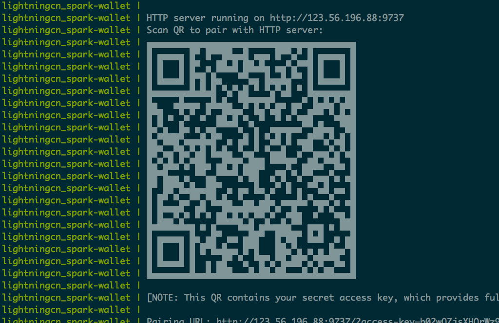
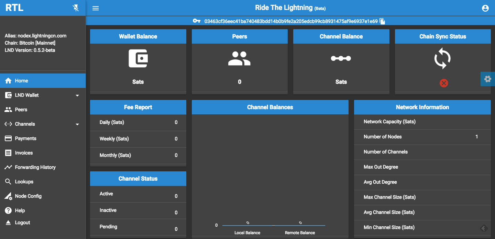

# 一键自动安装配置闪电网络节点

## 系统需求

   docker 和 docker-compose

## 硬件需求

   x86_64 或者arm32v7系统，比如树莓派2, 300G硬盘，内存1G以上

##  一键安装 bitcoin + clightning + spark 闪电网络节点

   ```
   sudo bash -c "$(curl -fsSL https://raw.github.com/lightningcn/ln-node/master/setup.sh)"
   ```

   终端会出现二维码和一个如下url，表示安装完毕，耐心等待同步完毕



   同步完成后, 可以使用spark wallet钱包扫出现的二维码连接节点

   spark wallet 支持windows, macos, linux, android等系统，下载地址 [https://github.com/shesek/spark-wallet/releases/](https://github.com/shesek/spark-wallet/releases)
   
[windows系统](https://github.com/shesek/spark-wallet/releases/download/v0.2.4/spark-wallet-0.2.4-win-setup.exe)

[android系统](https://github.com/shesek/spark-wallet/releases/download/v0.2.4/spark-wallet-0.2.4-android-release.apk)

[macos系统](https://github.com/shesek/spark-wallet/releases/download/v0.2.4/spark-wallet-0.2.4-mac.zip)

[linux](https://github.com/shesek/spark-wallet/releases/tag/v0.2.4)


## 一键安装bitcoin + lnd + rtl 闪电网络服务器

   ```
    sudo bash -c "$(curl -fsSL https://raw.github.com/lightningcn/ln-node/master/setup_lnd.sh)"
   ```

    出现如下结果表示安装完毕，等待同步完成即可 

       lightningcn_rtl-wallet1 | Server is up and running, please open the UI at http://localhost:3000

    可以登陆http://ip:3000查看节点状态



    默认登陆密码为lightningcn，可以在docker-compose.yml中修改RTL_PASS, 修改密码后需要重新启动

## 树莓派一键安装 bitcoin + lnd + rtl 闪电网络服务器 

   ```
    sudo bash -c "$(curl -fsSL https://raw.github.com/lightningcn/ln-node/master/setup_arm32v7.sh)"
   ```

## 树莓派zerow 安装 spruned + clightning + fulmo 闪电网络服务器 

   download https://github.com/lncm/pi-factory/releases/download/v0.4.1/lncm-box-v0.4.1.img.zip 

   ```
    sudo bash -c "$(curl -fsSL https://raw.github.com/lightningcn/ln-node/master/setup_arm32v6.sh)"
   ```
 
   

## arm64v8 一键安装 bitcoin + lnd + rtl 闪电网络服务器 

   ```
    sudo bash -c "$(curl -fsSL https://raw.github.com/lightningcn/ln-node/master/setup_arm64v8.sh)"
   ```
 

## test btcpay

   ```
     wget https://raw.github.com/lightningcn/ln-node/master/btcpay/docker-compose.yml
	 docker-compose up
   ```

## 其他操作系统

    ubuntu 18.04 上测试通过, 其他liunx版本，需要自己安装docker和docker-compose,

    下载对应的docker-compose.yml文件, 执行docker-compose up

    其他支持docker的系统如windows, mac 理论上也可以，没有测试过

## NAT

    如果节点没有公网IP，需要在路由器上配置NAT转换才可以，支持外部访问
